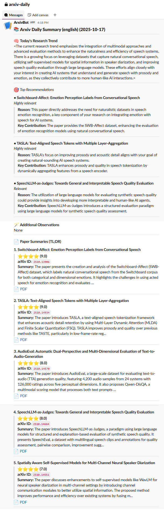

<!-- 🌌 Project Header -->
<p align="center">
  <!-- Optional Logo -->
  <!--  -->
</p>

<h1 align="center">💌 arxiv-daily-plus</h1>
<p align="center">
  <b>Your personal AI research assistant — find, rank, and summarize the latest arXiv papers,<br>
  then deliver them automatically to your Slack every morning ☀️</b>
</p>

<!-- ⭐ Social Buttons -->
<p align="center">
  <a href="https://github.com/sujin-koo/arxiv-daily-plus/stargazers">
    
  </a>
  <a href="https://github.com/sujin-koo/arxiv-daily-plus/fork">
    
  </a>
</p>

<!-- 💡 Tech Badges -->
<p align="center">
  
  
  
  
  
</p>

---

## 💡 What is *arxiv-daily-plus*?

Tired of missing important papers?
Scrolling through hundreds of titles every morning?

**arxiv-daily-plus** does that work for you.
It scans **new arXiv papers**, finds the ones that match *your interests*, and sends you a beautifully summarized digest —
right to **Slack** 💬 or your **inbox** 📩.

It’s like having your own *AI research assistant*, powered by GPT-4 (or any model you prefer, such as Ollama or DeepSeek).
You choose the engine, it does the reading. ⚙️

---

### 🧐 **Why I Built This Project**

Inspired by [zotero-arxiv-daily](https://github.com/TideDra/zotero-arxiv-daily) and [customize-arxiv-daily](https://github.com/JoeLeelyf/customize-arxiv-daily/),
I wanted a version that fits my workflow better — without relying on Zotero.
I often work on multiple topics and prefer flexible, text-based recommendations.
However, I found that the **quality of recommendations varied significantly depending on the model**,
so I decided to use a paid AI model, **GPT-4**, for more reliable results.
To save cost, I added a **filtering step** before sending papers to GPT.
And since I use **Slack** daily, I wanted my research digest delivered there automatically. 💌

If you find this project useful, please ⭐ **star** and **fork** ⭐ this repository! 
Special thanks to [TideDra](https://github.com/TideDra) and [JoeLeelyf](https://github.com/JoeLeelyf) for their inspiring work. 🙏

---

## ✨ **Why You’ll Love It**


* 🧠 **Smart, Personalized Recommendations** —
  Tell it what you care about (e.g. `--categories cs.CL cs.LG`), and it will fetch the latest papers from those categories.
Then, it personalizes recommendations based on your `description.txt`, understanding your unique research interests and focus.

* 💬 **Beautiful Summaries by GPT-4** —
  Each paper comes with a **title, link, TL;DR summary**, and a **relevance score** that explains why it was chosen.
  Summaries can be generated in **English, Korean, or Chinese** for better accessibility.

* ⚡ **Cost-Efficient, High-Quality Filtering** —
  To save API cost and time, only the most relevant papers are sent to GPT.
  Choose your filtering method with `--filter_method`:

  * 🟢 **bm25** – classic keyword-based ranking (fast & lightweight)
  * 🔵 **dpr** – dense passage retrieval using embedding similarity
  * 🟣 **splade** – sparse semantic representation model
  * ⚫ **none** – disable filtering and process all papers

* 💻 **Zero Setup, Fully Automated** —
  No Zotero required, no manual setup.
  Works seamlessly on **GitHub Actions**, runs *automatically* every morning,
  and sends your curated digest directly to **Slack** or **Email** ☕

---

## 🧩 Quick Start

Before you start, remember that to use **OpenAI models** and **Slack notifications**,
you’ll need both an **OpenAI API Key** and a **Slack Webhook URL**.
If you haven’t set them up yet, check out these short guides first:

* [OpenAI API Key 발급받는 법 (Korean)](https://velog.io/@sujin-koo/OpenAI-API-Key-%EB%B0%9C%EA%B8%89%EB%B0%9B%EB%8A%94-%EB%B2%95)
* [How to Get Your OpenAI API Key (English)](https://velog.io/@sujin-koo/How-to-Get-Your-OpenAI-API-Key)
* [Slack Webhook URL 설정 방법 (Korean)](https://velog.io/@sujin-koo/Slack-Webhook-URL-%EC%84%A4%EC%A0%95-%EB%B0%A9%EB%B2%95)
* [How to Get a Slack Webhook URL (English)](https://velog.io/@sujin-koo/How-to-Get-a-Slack-Webhook-URL)

### ⚙️ **Set Up in GitHub Actions**

1. **Fork this repo**
2. Add your **secrets** and **valuables** under
   `Settings → Security → Actions secrets and variables → Actions`

   #### 🔑 **Secrets**

   ```
   OPENAI_API_KEY  
   SLACK_WEBHOOK_URL  
   SMTP_SERVER  
   SENDER_PASSWORD
   ```

   #### 💾 **Valuables**

   ```
   CATEGORIES 
   FILTER_METHOD 
   LANGUAGE 
   MAX_PAPER_NUM
   MODEL 
   ```
3. Configure the workflow schedule in **GitHub Actions**  
   (e.g., run daily 🕙 to automatically send your customized paper digest to Slack or Email).  
   → See [`.github/workflows/arxiv_daily.yml`](https://github.com/sujin-koo/arxiv-daily-plus/blob/main/.github/workflows/arxiv_daily.yml) for an example configuration.


### 🖥️ **Run Locally**

Slack notification:

```bash
    python main.py \
    --categories cs.CL cs.LG \
    --provider OpenAI --model gpt-4o \
    --base_url https://api.openai.com/v1 \
    --api_key sk-xxxxx \
    --filter_method splade \
    --language korean \
    --notify_method slack \
    --slack_webhook_url https://hooks.slack.com/services/AAA/BBB/CCC

```

Email digest:

```bash
    python main.py \
    --categories cs.AI cs.SD \
    --provider OpenAI --model gpt-4o \
    --base_url https://api.openai.com/v1 \
    --api_key sk-xxxxx \
    --filter_method bm25 \
    --language english \
    --notify_method email \
    --smtp_server smtp.gmail.com \
    --smtp_port 587 \
    --sender your_email@gmail.com \
    --receiver target_email@gmail.com \
    --sender_password your_password
```

## 📚 Example Output

**Slack message example**



---
## ❤️ Acknowledgement


- [zotero-arxiv-daily](https://github.com/TideDra/zotero-arxiv-daily)
- [customize-arxiv-daily](https://github.com/JoeLeelyf/customize-arxiv-daily/)

---


